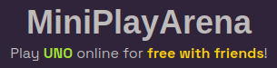

# MiniPlayArena
[![Contributors(client)][contributors-shield]][contributors-url-client]
[![Contributors(server)][contributors-shield]][contributors-url-server]
[![Issues][issues-shield]][issues-url]
[![MIT License][license-shield]][license-url]

<!-- PROJECT LOGO -->
<br />
<div align="center">
  <a href="https://github.com/MiniPlayArena/client/">
    
  </a>

<h3 align="center">MiniPlayArena</h3>

  <p align="center">
    Project for made for <a> <strong> HackSheffield 8</strong></a>. 
    <br />
    <br />
    <a href="https://miniplayarena.gasinski.dev">View Demo</a>
    ·
    <a href="https://github.com/MiniPlayArena/server/issues">Report Bug</a>
    ·
    <a href="https://github.com/MiniPlayArena/server/issues">Request Feature</a>
  </p>
</div>


<!-- TABLE OF CONTENTS -->
<details>
  <summary>Table of Contents</summary>
  <ol>
    <li>
      <a href="#about-the-project">About The Project</a>
      <ul>
        <li><a href="#built-with">Built With</a></li>
      </ul>
    </li>
    <li>
      <a href="#getting-started">Getting Started</a>
      <ul>
        <li><a href="#prerequisites">Prerequisites</a></li>
        <li><a href="#installation">Installation</a></li>
      </ul>
    </li>
    <li><a href="#usage">Usage</a></li>
    <li><a href="#roadmap">Roadmap</a></li>
    <li><a href="#contributing">Contributing</a></li>
    <li><a href="#license">License</a></li>
    <li><a href="#acknowledgments">Acknowledgments</a></li>
  </ol>
</details>


<!-- ABOUT THE PROJECT -->
## About The Project

[![MiniPlayArena][product-screenshot]](https://miniplayarena.gasinski.dev)
### Built With

* [![Next][Next.js]][Next-url]
* [![React][React.js]][React-url]
* [![Python][Python]][Python-url]
* [![Flask][Flask]][Flask-url]
* [![Chakra-UI][Chakra-UI]][Chakra-url]


<p align="right">(<a href="#readme-top">back to top</a>)</p>


<!-- GETTING STARTED -->
## Getting Started

### Prerequisites

To run the client
* npm
  ```sh
  npm install npm@latest -g
  ```
To run the server
* python 3.11.6
*   using `pyenv`
  ```sh
  pyenv install 3.11
  pyenv shell 3.11.6
  ```

### Installation

1. Clone both repos
   ```sh
   git clone https://github.com/MiniPlayArena/client
   git clone https://github.com/MiniPlayArena/server
   ```
2. Install NPM packages for the client
   ```sh
   cd client
   npm install
   ```
3. Run the client with
   ```sh
    npm run dev
   ```
4. Create a virtual environment with python
   ```sh
   cd server
   python3 -m venv venv
   source venv/bin/activate
   ```
5. Install the modules from `requirements.txt`
   ```sh
   pip install -r requirements.txt
   ```
6. Run the socket server with
   ```sh
   python3 app.py
   ```


<p align="right">(<a href="#readme-top">back to top</a>)</p>


<!-- ROADMAP -->
## Roadmap

- [ ] Better mobile support.
- [ ] Implement addition games.
- [ ] Implement a party chat system
- [ ] Additional Themes

See the [open issues](https://github.com/MiniPlayArena/server/issues) for a full list of proposed features (and known issues).

<p align="right">(<a href="#readme-top">back to top</a>)</p>


<!-- CONTRIBUTING -->
## Contributing

Contributions are what make the open source community such an amazing place to learn, inspire, and create. Any contributions you make are **greatly appreciated**.

If you have a suggestion that would make this better, please fork the repo and create a pull request. You can also simply open an issue with the tag "enhancement".
Don't forget to give the project a star! Thanks again!

1. Fork the Project
2. Create your Feature Branch (`git checkout -b feature/AmazingFeature`)
3. Commit your Changes (`git commit -m 'Add some AmazingFeature'`)
4. Push to the Branch (`git push origin feature/AmazingFeature`)
5. Open a Pull Request

<p align="right">(<a href="#readme-top">back to top</a>)</p>


<!-- LICENSE -->
## License

Distributed under the MIT License. See `LICENSE.txt` for more information.

<p align="right">(<a href="#readme-top">back to top</a>)</p>

<!-- ACKNOWLEDGMENTS -->
## Acknowledgments
### Developers

* [Julian Jones](https://github.com/NexInfinite)
* [David Gasinski](https://github.com/david-gasinski)
* [Kush Makkapati](https://github.com/1Blademaster)
* [Joe Paton](https://github.com/Jopat2409)

<p align="right">(<a :="#readme-top">back to top</a>)</p>

<!-- MARKDOWN LINKS & IMAGES -->
<!-- https://www.markdownguide.org/basic-syntax/#reference-style-links -->
[contributors-shield]: https://img.shields.io/github/contributors/MiniPlayArena/client.svg?style=for-the-badge
[contributors-url-client]: https://github.com/MiniPlayArena/client/graphs/contributors
[contributors-url-server]: https://github.com/MiniPlayArena/server/graphs/contributors
[issues-shield]: https://img.shields.io/github/issues/MiniPlayArena/client.svg?style=for-the-badge
[issues-url]: https://github.com/MiniPlayArena/client/issues
[license-shield]: https://img.shields.io/github/license/MiniPlayArena/client.svg?style=for-the-badge
[license-url]: https://github.com/MiniPlayArena/client/blob/main/LICENSE.txt
[product-screenshot]: images/screenshot.png
[Next.js]: https://img.shields.io/badge/next.js-000000?style=for-the-badge&logo=nextdotjs&logoColor=white
[Next-url]: https://nextjs.org/
[React.js]: https://img.shields.io/badge/React-20232A?style=for-the-badge&logo=react&logoColor=61DAFB
[React-url]: https://reactjs.org/
[Chakra-UI]: https://img.shields.io/badge/Chakra-319795?style=for-the-badge&logo=chakra&logoColor=white
[Chakra-url]: https://chakra-ui.com/
[Python]: https://img.shields.io/badge/Python-4584b6?style=for-the-badge&logo=python&logoColor=white
[Python-url]: https://www.python.org/
[Flask]: https://img.shields.io/badge/Flask-000000?style=for-the-badge&logo=flask&logoColor=white
[Flask-url]: https://flask.palletsprojects.com/en/3.0.x/


